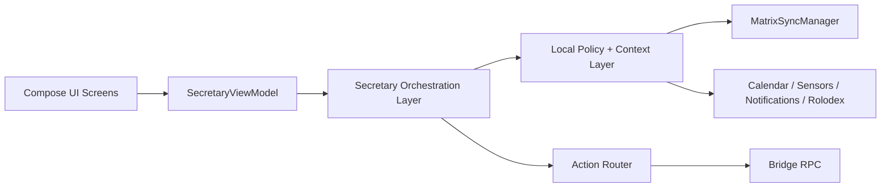

## architecture

The architecture should be stated as four layers, not two.



### 1. UI layer

Owns:

* card rendering
* avatar/state indicator
* user actions
* approval prompts
* privacy-masked variants

### 2. Orchestration layer

Owns:

* event analysis
* deciding whether to propose, execute, or wait
* state transitions
* cooldown/snooze/dismiss memory

### 3. Local policy and context layer

Owns:

* privacy masking
* urgency scoring
* meeting/sleep/focus mode
* public/private/biometric visibility rules
* deterministic triage

### 4. Action router

Owns:

* deciding whether an action is local or Bridge-backed
* capability lookup
* safe parameter passing
* RPC error normalization

That separation will keep `SecretaryViewModel` from turning into a monolith.

---

## What to change in the proposed code

### 1. `SecretaryAction` should not carry raw RPC method strings as the main contract

This is brittle.

Instead of:

```kotlin
data class SecretaryAction(
    val label: String,
    val rpcMethod: String? = null,
    val localAction: String? = null
)
```

use a typed model:

```kotlin
sealed interface SecretaryActionTarget {
    data class Local(val action: LocalSecretaryAction) : SecretaryActionTarget
    data class Bridge(val command: BridgeSecretaryCommand) : SecretaryActionTarget
}

enum class LocalSecretaryAction {
    NAV_CHAT,
    OPEN_BRIEFING,
    OPEN_APPROVALS,
    DISMISS_CARD,
    SNOOZE_CARD
}

sealed interface BridgeSecretaryCommand {
    data class StartWorkflow(val workflowId: String) : BridgeSecretaryCommand
    data class StartAgent(val agentId: String) : BridgeSecretaryCommand
    data class ApproveHitl(val requestId: String) : BridgeSecretaryCommand
}
```

This gives you compiler-checked routing.

### 2. `SecretaryViewModel` needs an engine and reducer boundary

Right now it is still too imperative.

Recommended shape:

```kotlin
class SecretaryViewModel(
    private val engine: SecretaryEngine,
    private val contextProvider: SecretaryContextProvider,
    private val actionRouter: SecretaryActionRouter,
    private val matrixSyncManager: MatrixSyncManager
) : ViewModel() {

    private val _state = MutableStateFlow<SecretaryState>(SecretaryState.Idle)
    val state = _state.asStateFlow()

    private val _cards = MutableStateFlow<List<ProactiveCard>>(emptyList())
    val cards = _cards.asStateFlow()

    init {
        observeContext()
        observeMatrix()
    }

    private fun observeMatrix() { /* collect and reduce */ }
    private fun observeContext() { /* collect and reduce */ }

    fun onAction(cardId: String, actionId: String) { /* delegate */ }
    fun onDismiss(cardId: String) { /* delegate */ }
}
```

The ViewModel should orchestrate flows, not embed business rules.

### 3. `SecretaryState` should include execution progress and suspension

Your revised state needs two more practical states:

```kotlin
sealed class SecretaryState {
    object Idle : SecretaryState()
    data class Observing(val reason: String? = null) : SecretaryState()
    data class Thinking(val task: String) : SecretaryState()
    data class Proposing(val cards: List<ProactiveCard>) : SecretaryState()
    data class Executing(val label: String, val progress: Float? = null) : SecretaryState()
    data class WaitingApproval(val requestId: String, val summary: String) : SecretaryState()
    data class Suspended(val reason: String) : SecretaryState()
    data class Error(val message: String, val recoverable: Boolean = true) : SecretaryState()
}
```

`Suspended` matters for:

* privacy guard active
* offline state
* low-power mode
* user-disabled Secretary mode

### 4. `SecretaryContextProvider` should be a flow aggregator, not a one-shot fetcher

Instead of only `getBriefingContext()`, it should expose a live context flow:

```kotlin
interface SecretaryContextProvider {
    val context: Flow<SecretaryContext>
    suspend fun snapshot(): SecretaryContext
}
```

Suggested `SecretaryContext`:

```kotlin
data class SecretaryContext(
    val isMorning: Boolean,
    val isSleepingHours: Boolean,
    val isInMeeting: Boolean,
    val isDriving: Boolean,
    val isInPublicPlace: Boolean,
    val unreadCount: Int,
    val pendingApprovals: Int,
    val nextMeeting: CalendarEvent?,
    val vipUnreadCount: Int,
    val headsetConnected: Boolean,
    val biometricAvailable: Boolean
)
```

This will let the Secretary react continuously instead of polling.

---

## Expanded implementation plan

Here’s the **Phase 1 packet** tightened into an execution-ready plan with **acceptance tests defined first**.

### Phase 1 goal

Build the **Secretary shell** in ArmorChat:

* core models
* state machine
* ViewModel
* two UI primitives
* one deterministic behavior:

  * **urgent Matrix event → proactive card**

This phase should **not** include:

* Bridge RPC execution
* privacy guard
* briefing logic
* voice
* full context provider

This is just the smallest vertical slice that proves the Secretary UX loop works.

---

### Acceptance tests first

#### Test group A — models and state

##### A1. `SecretaryState` default behavior

**Given**

* a new `SecretaryViewModel`

**Expect**

* initial state is `SecretaryState.Idle`
* proactive card list is empty

##### A2. `SecretaryState` transition to proposing

**Given**

* an urgent Matrix event arrives

**Expect**

* state becomes `SecretaryState.Proposing`
* exactly one `ProactiveCard` is present

##### A3. dismiss behavior

**Given**

* a proactive card exists

**When**

* user dismisses the card

**Expect**

* the card is removed
* state returns to `Idle` if no other cards remain

---

#### Test group B — urgent Matrix event triage

##### B1. urgent keyword triggers proactive card

**Given**

* a Matrix message contains `"urgent"` or `"asap"`

**Expect**

* a proactive card is created
* card title indicates urgent attention
* card priority is high or critical

##### B2. non-urgent message does not trigger card

**Given**

* a normal Matrix message with no urgent/VIP rule match

**Expect**

* no proactive card is created
* state stays `Idle` or `Observing`

##### B3. VIP sender triggers proactive card

**Given**

* message sender is in a VIP set

**Expect**

* proactive card is created even without urgent keyword
* card reason reflects VIP priority

##### B4. duplicate event is ignored

**Given**

* the same Matrix event ID is processed twice

**Expect**

* only one proactive card exists
* state is stable

---

#### Test group C — card action plumbing

##### C1. local action is emitted

**Given**

* a proactive card with local action `NAV_CHAT`

**When**

* user taps primary action

**Expect**

* ViewModel emits a local UI action/event
* card may remain or dismiss depending on action type
* no Bridge RPC is called in Phase 1

##### C2. dismiss action is emitted

**Given**

* a proactive card

**When**

* user taps dismiss

**Expect**

* card is removed
* dismissal is recorded in ViewModel state

---

#### Test group D — Compose rendering sanity

##### D1. `ProactiveCard` renders title and actions

**Given**

* a populated `ProactiveCard`

**Expect**

* title is visible
* subtitle/description is visible if present
* primary action button is visible
* dismiss button is visible when dismissible

##### D2. `SecretaryAvatar` reflects state

**Given**

* `Idle`, `Thinking`, `Proposing`, `Error`

**Expect**

* state indicator changes correctly for each state

---

# Files to implement

#### 1. `SecretaryModels.kt`

Owns the base typed models used by state, VM, and UI.

##### Include

* `ProactiveCard`
* `SecretaryAction`
* `SecretaryPriority`
* `SecretaryCardReason`
* maybe `SecretaryUiEvent` for local UI-only actions

##### Recommended shape

```kotlin
package ...secretary

enum class SecretaryPriority {
    LOW, NORMAL, HIGH, CRITICAL
}

sealed interface SecretaryAction {
    data class Local(val action: LocalSecretaryAction) : SecretaryAction
}

enum class LocalSecretaryAction {
    NAV_CHAT,
    OPEN_MESSAGE,
    DISMISS_CARD,
    SNOOZE_CARD
}

enum class SecretaryCardReason {
    URGENT_KEYWORD,
    VIP_SENDER
}

data class ProactiveCard(
    val id: String,
    val title: String,
    val description: String,
    val priority: SecretaryPriority,
    val reason: SecretaryCardReason,
    val primaryAction: SecretaryAction,
    val dismissible: Boolean = true
)
```

##### Acceptance criteria

* no raw stringly-typed action routing
* model is UI-safe and serializable if needed
* fields are sufficient for first card use case

---

#### 2. `SecretaryState.kt`

Owns state machine for the Secretary shell.

##### Include

* `Idle`
* `Observing`
* `Thinking`
* `Proposing`
* `Error`

For Phase 1, keep it lean.

##### Recommended shape

```kotlin
sealed class SecretaryState {
    object Idle : SecretaryState()
    data class Observing(val context: String? = null) : SecretaryState()
    data class Thinking(val task: String) : SecretaryState()
    data class Proposing(val cards: List<ProactiveCard>) : SecretaryState()
    data class Error(val message: String, val recoverable: Boolean = true) : SecretaryState()
}
```

##### Acceptance criteria

* state is simple enough for Compose rendering
* supports 1+ cards
* no execution/approval states yet unless already needed for consistency

---

#### 3. `SecretaryViewModel.kt`

Owns state, card list, and Matrix event observation.

##### Responsibilities

* subscribe to existing `MatrixSyncManager`
* inspect incoming Matrix events
* create card for urgent/VIP message
* dedupe by event ID
* dismiss/remove cards
* expose local UI events for action taps

##### Required behavior

* initial state is `Idle`
* on urgent event → add card → state `Proposing`
* on dismiss → remove card → return to `Idle` if none remain
* ignore duplicate event IDs

##### Keep out of scope

* Bridge RPC
* calendar aggregation
* privacy policies
* approvals
* voice
* persistent card storage

##### Suggested methods

* `observeMatrixEvents()`
* `analyzeEvent(event)`
* `addCard(card)`
* `dismissCard(cardId)`
* `onPrimaryAction(cardId)`
* `reduceState()`

##### Acceptance criteria

* deterministic triage only
* testable with fake `MatrixSyncManager`
* no direct Compose code in ViewModel
* no hardcoded RPC calls

---

#### 4. `ProactiveCard.kt`

Compose UI for the card.

##### Responsibilities

* render urgency/priority
* render title + description
* render primary action
* render dismiss if allowed

##### Acceptance criteria

* visually stable for all priority levels
* no business logic
* only presentational decisions

---

#### 5. `SecretaryAvatar.kt`

Compose UI state indicator.

##### Responsibilities

* show current Secretary state visually
* support `Idle`, `Thinking`, `Proposing`, `Error`

##### Acceptance criteria

* state indicator changes predictably
* does not own orchestration logic
* suitable for reuse on home/dashboard surfaces

---

#### 6. Tests

You should define these before implementation.

##### Recommended test files

* `SecretaryViewModelTest.kt`
* `ProactiveCardTest.kt`
* `SecretaryAvatarTest.kt`

##### Minimum first-pass tests

1. initial state is idle
2. urgent message creates proactive card
3. VIP sender creates proactive card
4. normal message does not create card
5. duplicate event is ignored
6. dismiss removes card and returns to idle
7. `ProactiveCard` renders title and button
8. `SecretaryAvatar` changes for `Idle/Thinking/Error`

---

### Suggested packet to give OMO

```text
Implement one subsystem only: ArmorChat Secretary Phase 1 shell.

Files allowed:
- SecretaryModels.kt
- SecretaryState.kt
- SecretaryViewModel.kt
- ProactiveCard.kt
- SecretaryAvatar.kt
- test files required for this subsystem only

Objective:
Build the Secretary shell for ArmorChat with deterministic Matrix-event-driven proactive cards.

Requirements:
- Define typed Secretary models
- Define Secretary state machine
- Implement SecretaryViewModel using existing MatrixSyncManager
- Detect urgent Matrix events using deterministic rules only
- Create proactive cards for urgent keyword or VIP sender
- Support dismissing proactive cards
- Ignore duplicate Matrix event IDs
- Add Compose UI for ProactiveCard and SecretaryAvatar
- Add tests first for urgent event -> proactive card behavior
- Do not add Bridge RPC execution
- Do not add privacy, briefing, approvals, or voice in this phase
- Do not modify unrelated files
- Do not add new dependencies

Acceptance tests to implement:
- initial state is Idle
- urgent keyword creates proactive card
- VIP sender creates proactive card
- non-urgent message does not create card
- duplicate event is ignored
- dismiss removes card and returns state to Idle when no cards remain
- ProactiveCard renders title and primary action
- SecretaryAvatar reflects Idle / Thinking / Proposing / Error

Verification:
- app module builds
- relevant unit/UI tests pass
```

---

Here’s a stronger **Phase 2** rewrite in the same execution-ready style as Phase 1.

---
---

#### Phase 2 — Briefing and review

##### Goal

Deliver the first high-value **Secretary summary experience** in ArmorChat by generating:

* a **Morning Briefing** card
* an **Evening Review** card
* one **recommended next action** chip

This phase should stay **low-risk and deterministic**. It should summarize existing context, not initiate complex workflows.

##### Scope

Phase 2 adds **context aggregation and summary generation**, but still does **not** include:

* Bridge-backed workflow execution
* approval routing
* privacy guard policy enforcement
* voice interaction
* automatic status changes
* follow-up engine logic

This phase is about giving the user a useful, calm summary at the right time.

---

#### Acceptance tests first

##### Test group A — Morning briefing behavior

###### A1. morning briefing appears in configured time window

**Given**

* current time is inside the configured morning window

**And**

* sufficient context exists

**Expect**

* a Morning Briefing card is generated

##### A2. morning briefing does not appear outside time window

**Given**

* current time is outside the configured morning window

**Expect**

* no Morning Briefing card is generated

##### A3. morning briefing is not duplicated on the same day

**Given**

* a Morning Briefing has already been shown today

**Expect**

* no second Morning Briefing card is generated unless reset rules allow it

---

#### Test group B — Evening review behavior

##### B1. evening review appears in configured evening window

**Given**

* current time is inside the configured evening window

**And**

* review feature is enabled

**Expect**

* an Evening Review card is generated

##### B2. evening review can be disabled

**Given**

* evening review feature flag or user setting is off

**Expect**

* no Evening Review card is generated

##### B3. evening review is not duplicated on the same day

**Given**

* an Evening Review has already been shown today

**Expect**

* no second Evening Review card is generated unless reset rules allow it

---

#### Test group C — Context quality and fallback behavior

##### C1. no card when context is insufficient

**Given**

* unread count, calendar data, and pending approval data are all unavailable or empty beyond minimum threshold

**Expect**

* no briefing card is generated

##### C2. partial context still produces stable summary

**Given**

* some context sources are available and others are missing

**Expect**

* summary is still generated if minimum useful data exists
* missing sources do not crash generation
* wording remains stable and user-friendly

##### C3. weekend behavior changes summary correctly

**Given**

* current day is Saturday or Sunday

**Expect**

* summary wording reflects weekend mode
* work-centric assumptions are reduced or removed

---

#### Test group D — Summary content

##### D1. briefing includes unread count

**Given**

* unread messages exist

**Expect**

* card summary includes unread count

##### D2. briefing includes next meeting

**Given**

* a same-day upcoming calendar event exists

**Expect**

* summary includes next meeting or first meeting information

##### D3. briefing includes pending approvals

**Given**

* pending HITL approvals exist

**Expect**

* summary includes pending approval count

##### D4. recommended action chip is present

**Given**

* summary context contains at least one actionable item

**Expect**

* one recommended next action chip is generated

##### D5. summary generation is deterministic

**Given**

* the same input context

**Expect**

* the same summary card content is generated each time

---

### Deliverables

#### 1. `SecretaryBriefingEngine.kt`

Owns deterministic generation of briefing/review UI models.

##### Responsibilities

* decide whether to generate:

  * Morning Briefing
  * Evening Review
* compose stable summary text
* generate one recommended action chip
* prevent duplicate cards within the same day unless reset conditions apply

##### Should include

* time-window evaluation
* summary builder
* first-action recommendation logic
* duplicate suppression logic

##### Should not include

* Bridge RPC execution
* notification posting
* direct Compose UI code
* sensor-heavy privacy behavior
* action execution side effects

##### Acceptance criteria

* generates briefing/review cards deterministically
* does not generate duplicate cards for the same period/day
* handles missing context safely

---

#### 2. `SecretaryContextProvider.kt`

Owns context aggregation for summary generation.

##### Responsibilities

Aggregate the minimum Secretary context needed for Phase 2:

* unread message count
* VIP/high-priority unread count if available
* next meeting / first meeting today
* pending approvals
* whether today is weekend
* whether briefing/review has already been shown today

##### Suggested output model

```kotlin id="1ljjjt"
data class SecretaryBriefingContext(
    val now: Instant,
    val isWeekend: Boolean,
    val unreadCount: Int,
    val highPriorityUnreadCount: Int,
    val pendingApprovals: Int,
    val nextMeeting: CalendarEvent?,
    val firstMeetingToday: CalendarEvent?,
    val morningBriefingShownToday: Boolean,
    val eveningReviewShownToday: Boolean
)
```

##### Acceptance criteria

* safely merges available sources
* missing or failing source returns degraded but usable context
* does not embed UI formatting logic

---

#### 3. Morning Briefing card

The first high-value proactive summary shown near the start of the day.

##### Content guidelines

Include only the most useful facts:

* greeting
* unread count
* next or first meeting
* pending approvals
* one action chip

##### Example shape

* “Good morning.”
* “You have 12 unread messages.”
* “Your first meeting is at 10:00 AM.”
* “You have 2 pending approvals.”
* Action chip: `Review approvals`

##### Acceptance criteria

* appears only during configured morning window
* not repeated the same day unless reset
* wording stays concise and calm

---

#### 4. Evening Review card

A lightweight end-of-day summary.

##### Content guidelines

Include:

* unread or unresolved items
* pending approvals
* tomorrow-facing hint if available
* one action chip

##### Example shape

* “Good evening.”
* “You still have 4 unread priority messages.”
* “2 approvals are waiting.”
* “Tomorrow starts with a 9:00 AM meeting.”
* Action chip: `Prepare tomorrow`

##### Acceptance criteria

* appears only during configured evening window
* can be toggled on/off
* not repeated the same day unless reset

---

#### 5. First-action recommendation chip

A single recommended next step derived deterministically from context.

##### Rule examples

Priority order:

1. pending approvals
2. next meeting preparation
3. unread VIP/high-priority messages
4. general inbox review

##### Acceptance criteria

* only one primary recommendation chip
* deterministic ordering
* no aggressive or noisy suggestions

---

### Suggested implementation shape

#### `SecretaryBriefingEngine.kt`

Suggested methods:

* `generateMorningBriefing(context)`
* `generateEveningReview(context)`
* `shouldShowMorningBriefing(context, settings)`
* `shouldShowEveningReview(context, settings)`
* `buildSummary(context, period)`
* `buildPrimaryAction(context, period)`

#### `SecretaryContextProvider.kt`

Suggested methods:

* `getBriefingContext()`
* `getReviewContext()`
* `snapshot()`

If the app already uses flows heavily, it can expose a context flow, but Phase 2 does not require continuous reactive context for every source. A stable snapshot model is acceptable here.

---

### Test focus

#### Core logic tests

* morning vs evening window behavior
* duplicate suppression in same day
* weekend wording changes
* no-card when insufficient context
* stable deterministic output for same input

#### Context tests

* unread count aggregation
* pending approvals count included
* meeting selection logic prefers next/first meeting correctly
* partial data does not crash summary generation

#### UI tests

* Morning Briefing card renders expected title/summary/action
* Evening Review card renders correctly
* single recommendation chip renders when present

---

### Suggested packet to give OMO

```text id="xeqjpj"
Implement one subsystem only: ArmorChat Secretary Phase 2 briefing and review.

Files allowed:
- SecretaryBriefingEngine.kt
- SecretaryContextProvider.kt
- related model/test files strictly required for this subsystem
- minimal wiring into existing SecretaryViewModel if required
- do not modify unrelated files
- do not add new dependencies

Objective:
Add deterministic Morning Briefing and Evening Review generation for ArmorChat Secretary.

Requirements:
- Implement SecretaryBriefingEngine
- Implement SecretaryContextProvider
- Generate Morning Briefing card only in configured morning window
- Generate Evening Review card only in configured evening window
- Include unread count, next/first meeting, and pending approvals where available
- Prevent duplicate briefing/review cards within the same day unless reset
- Support disabling Evening Review
- Generate one deterministic first-action recommendation chip
- Handle partial context safely
- Do not add Bridge RPC execution in this phase
- Do not add privacy guard or voice in this phase

Acceptance tests to implement first:
- morning briefing appears only in morning window
- evening review appears only in evening window
- no duplicate briefing within same day
- evening review can be disabled
- weekend behavior changes summary correctly
- no-card when context is insufficient
- summary generation is deterministic
- recommendation chip is generated deterministically

Verification:
- app module builds
- relevant unit/UI tests pass
```

--- 


---

## Phase 3 — Context and triage

Phase 3 — Context and triage
Goal

Implement deterministic attention management for ArmorChat Secretary using existing Matrix and app context, so the app can:

suppress noise during constrained contexts,

elevate urgent/VIP/calendar-linked events,

detect stale outbound threads that deserve follow-up,

and generate proactive cards consistently.

This phase should use Matrix /sync events as the primary real-time signal, because the latest review explicitly states that real-time events come from Matrix /sync, not Bridge WebSocket.

Scope
In scope

SecretaryPolicyEngine.kt

deterministic triage scoring/rules

meeting mode

focus mode

sleep mode

follow-up detection

cooldown/snooze logic

proactive card generation for triage outcomes

Out of scope

Bridge RPC execution

approvals/HITL handling

trusted workflow execution

privacy guard masking rules in full depth

voice surfaces

model-assisted triage

This phase should remain local, deterministic, and test-heavy.

Acceptance tests first
Test group A — mode transitions
A1. meeting mode activates during active calendar event

Given

current time overlaps an active meeting

Expect

Secretary mode becomes MEETING

non-urgent notifications are suppressed

urgent/VIP items may still surface

A2. focus mode respects whitelist

Given

focus mode is enabled

a sender is not in the whitelist

Expect

message does not produce proactive card unless it matches critical override rule

A3. sleep mode suppresses normal traffic

Given

current time is inside sleep window

Expect

normal and medium-priority items are deferred

critical items may still surface if rule allows

A4. explicit mode precedence is stable

Given

user is both in sleep hours and in a meeting edge case

Expect

mode precedence is deterministic and documented

Recommended precedence:

manual focus override

sleep mode

meeting mode

normal mode

Test group B — triage priority assignment
B1. urgent keyword raises priority

Given

incoming Matrix message contains urgent keyword

Expect

triage result is HIGH or CRITICAL

B2. VIP sender raises priority

Given

sender is a VIP

Expect

triage result is elevated even without urgent keyword

B3. calendar-linked thread raises priority

Given

message sender/contact is linked to a same-day meeting

Expect

triage result is higher than ordinary chat

B4. low-signal message stays batched

Given

ordinary message from non-VIP sender without urgent/calendar context

Expect

no proactive card is generated

item is eligible for batch/digest behavior later

B5. same input yields same triage result

Given

same event and same context

Expect

triage output is deterministic

Test group C — follow-up engine
C1. no reply after threshold creates follow-up prompt

Given

outgoing message is older than threshold

no matching reply exists

thread confidence passes threshold

Expect

follow-up proactive card is generated

C2. reply received cancels follow-up prompt

Given

follow-up candidate thread receives reply

Expect

no follow-up card is produced

C3. recent thread does not prompt

Given

message age is below threshold

Expect

no follow-up prompt

C4. snoozed follow-up respects cooldown

Given

user snoozes a follow-up prompt

Expect

prompt does not reappear until cooldown expires

C5. dismissed follow-up can be permanently muted

Given

user selects “don’t remind again” for a thread

Expect

thread is excluded from future follow-up prompts unless reset

Test group D — card generation
D1. high-priority triage produces card

Given

triage result crosses display threshold

Expect

ProactiveCard is created with correct reason and priority

D2. suppressed event does not produce card

Given

current mode suppresses event

Expect

no card is created

D3. duplicate event/card is ignored

Given

same event processed twice

Expect

no duplicate card appears

Deliverables
1. SecretaryPolicyEngine.kt

This is the core of Phase 3.

Responsibilities

determine current Secretary mode

score incoming events

decide whether to:

suppress

batch

surface as proactive card

mark as follow-up candidate

Recommended inputs

current time

focus mode flag

active meeting state

whitelist/VIP list

message metadata

sender/contact metadata

calendar linkage

thread history

snooze/dismiss history

Recommended outputs
data class TriageDecision(
    val mode: SecretaryMode,
    val priority: SecretaryPriority,
    val shouldNotify: Boolean,
    val shouldCreateCard: Boolean,
    val shouldBatch: Boolean,
    val reason: SecretaryDecisionReason
)
Acceptance criteria

deterministic decisions

no Bridge calls

no UI code

testable with pure inputs/outputs

2. Meeting mode
Behavior

suppress non-urgent notifications

allow urgent and VIP overrides

optionally downgrade card style instead of fully hiding

Implementation note

Use local calendar overlap and Matrix event urgency only. Do not auto-reply in this phase.

Acceptance criteria

only urgent/VIP/calendar-critical items break through

behavior is deterministic

3. Focus mode
Behavior

whitelist-only by default

urgent override allowed only for critical rule matches

no ordinary proactive cards

Acceptance criteria

non-whitelist traffic is suppressed or batched

whitelist behavior is stable and explainable

4. Sleep mode
Behavior

batch normal traffic

suppress noisy cards

allow only critical exceptions

Acceptance criteria

no normal proactive cards overnight

critical exceptions remain possible

5. Urgent / VIP / calendar-linked triage

This should be rules-first, not AI-scored.

Suggested rule order

critical urgent keyword

VIP sender

sender/contact tied to upcoming meeting

reply to pending approval or blocked task

ordinary message

Acceptance criteria

ordering is documented

same input produces same output

triage reasons are debuggable

6. Follow-up engine
Responsibilities

detect outbound threads with no reply after threshold

generate one follow-up card

respect snooze and dismiss state

avoid nagging

Suggested first thresholds

default threshold: 48 hours

confidence requires:

outbound thread exists

no inbound reply

no recent dismiss/snooze

not already closed/resolved

Suggested actions

Remind

Snooze

Dismiss

Don’t remind again

Acceptance criteria

no false-positive spam

cooldown works

follow-up state is deterministic

Recommended package layout
Shared / KMP
shared/src/commonMain/.../secretary/
  SecretaryPolicyEngine.kt
  SecretaryMode.kt
  SecretaryTriage.kt
  SecretaryFollowUp.kt
  SecretaryRules.kt
Android app
androidApp/src/main/kotlin/.../secretary/
  SecretaryModeCoordinator.kt
  SecretaryFollowUpStore.kt
  SecretaryViewModel.kt   // minimal wiring only

Keep the rule engine in shared/KMP where possible.

Integration guidance

Phase 3 should explicitly reuse:

MatrixSyncManager for message/presence/timeline input, because the app’s real-time path is Matrix /sync, not WebSocket. implemented. look like failures. plan constraints. high-value deterministic coverage upward.

---
---

## Phase 4 — Privacy guard and Rolodex tiers

### Goal

Implement **safe on-device presentation rules** for ArmorChat Secretary so that sensitive context is only displayed, previewed, or spoken when the current device, environment, and authentication state allow it.

This phase should protect:

* Secretary cards
* notification previews
* Rolodex overlays
* TTS output
* sensitive message/context snippets

This phase should remain **local-first** and should not depend on Bridge execution.

---

## Scope

### In scope

* `PrivacyGuardPolicy.kt`
* sensitivity-tier decisions
* tiered Rolodex/contact rendering
* biometric-gated reveal flows
* masked notification preview mode
* public-place behavior switches
* TTS suppression for sensitive content
* shared visibility decision models

### Out of scope

* Bridge RPC execution
* workflow approvals themselves
* remote trust policy changes
* always-on voice or hotword
* full accessibility/TTS redesign
* server-side content redaction

---

# Acceptance tests first

## Test group A — visibility tier decisions

### A1. public-safe content is always visible

**Given**

* a contact field marked `PUBLIC_SAFE`

**Expect**

* it can render without biometric gate
* it is eligible for notification preview if other privacy conditions allow

### A2. private-device content requires trusted device context

**Given**

* a field marked `PRIVATE_DEVICE`

**And**

* device is not in trusted local state

**Expect**

* field is hidden or masked

### A3. biometric-gated content requires successful authentication

**Given**

* a field marked `BIOMETRIC_GATED`

**Expect**

* field is not visible until biometric auth succeeds

### A4. biometric reveal only unlocks gated tier

**Given**

* biometric auth succeeds

**Expect**

* only `BIOMETRIC_GATED` content for the current surface becomes visible
* unrelated hidden content is not globally unlocked

---

## Test group B — public-risk state behavior

### B1. push preview is masked in public-risk state

**Given**

* device is in public-risk state

**And**

* content is sensitive

**Expect**

* push notification preview is masked
* generic wording is used instead

### B2. non-sensitive content may still preview in public-risk state

**Given**

* device is in public-risk state

**And**

* content is `PUBLIC_SAFE`

**Expect**

* preview may still be shown if policy allows

### B3. public-place + no headset suppresses TTS for sensitive content

**Given**

* device is in public-risk state
* headset is disconnected
* content is sensitive

**Expect**

* TTS is suppressed

### B4. public-place + headset may allow reduced TTS summary

**Given**

* headset is connected
* content is sensitive

**Expect**

* policy may allow a shortened safe summary, not full sensitive readout

---

## Test group C — Rolodex rendering

### C1. public-safe tier renders immediately

**Given**

* a Rolodex entry includes `PUBLIC_SAFE` fields

**Expect**

* those fields render immediately

### C2. private-device tier respects trusted-device state

**Given**

* Rolodex field is `PRIVATE_DEVICE`

**Expect**

* field is only rendered when local trusted conditions are met

### C3. biometric-gated tier shows explicit reveal affordance

**Given**

* Rolodex field is `BIOMETRIC_GATED`

**Expect**

* UI shows a reveal button / locked state
* field content is not preloaded into visible text

### C4. failed biometric does not reveal content

**Given**

* biometric auth fails or is cancelled

**Expect**

* sensitive content remains hidden
* UI returns to locked or masked state

---

## Test group D — masking logic

### D1. sensitive Secretary card subtitle is masked

**Given**

* a proactive card contains sensitive secondary detail

**And**

* current privacy state is restrictive

**Expect**

* card subtitle is masked or generalized

### D2. same content yields same visibility decision

**Given**

* identical content and identical privacy context

**Expect**

* visibility decision is deterministic

### D3. missing sensor/context falls back safely

**Given**

* location/headset/foreground info is unavailable

**Expect**

* policy falls back to conservative masking, not permissive reveal

---

# Deliverables

## 1. `PrivacyGuardPolicy.kt`

This is the main deliverable.

### Responsibilities

* decide what content can be:

  * rendered
  * previewed
  * spoken
  * biometrically revealed
* evaluate current device/environment risk
* apply consistent masking rules across surfaces

### Recommended inputs

* content sensitivity tier
* current device lock/auth state
* app foreground/background state
* trusted location state
* public-place state
* headset/Bluetooth audio state
* TTS enabled state
* biometric availability
* user privacy preferences

### Recommended outputs

```kotlin id="9t9jv3"
enum class SecretarySensitivityTier {
    PUBLIC_SAFE,
    PRIVATE_DEVICE,
    BIOMETRIC_GATED
}

enum class ContentSurface {
    INLINE_UI,
    NOTIFICATION_PREVIEW,
    TTS_OUTPUT,
    CONTACT_OVERLAY
}

data class PrivacyDecision(
    val visible: Boolean,
    val masked: Boolean,
    val allowTts: Boolean,
    val requiresBiometric: Boolean,
    val allowedTier: SecretarySensitivityTier?,
    val reason: PrivacyDecisionReason
)
```

### Acceptance criteria

* policy decisions are deterministic
* no UI rendering logic inside the policy
* same rules can be reused by Secretary cards, notifications, and Rolodex overlays

---

## 2. Tiered contact rendering

### Goal

Render contact/rolodex context according to sensitivity tier and current privacy decision.

### Recommended tiers

* `PUBLIC_SAFE`
* `PRIVATE_DEVICE`
* `BIOMETRIC_GATED`

### Behavior

* `PUBLIC_SAFE` → visible normally
* `PRIVATE_DEVICE` → visible only when local conditions are safe
* `BIOMETRIC_GATED` → masked until explicit biometric reveal

### Acceptance criteria

* tier logic is shared, not duplicated
* rendering is policy-driven
* sensitive content is never accidentally displayed by default

---

## 3. Biometric-gated sensitive context

### Goal

Require explicit biometric confirmation before showing the highest-sensitivity details.

### Implementation guidance

* keep biometric reveal **surface-scoped**
* do not globally unlock all sensitive Secretary content
* reveal only the specific card/contact panel/overlay being accessed
* require re-authentication after timeout or app backgrounding if needed

### Acceptance criteria

* failed biometric keeps content masked
* successful biometric reveals only gated tier
* reveal state expires safely

---

## 4. Masked notification preview mode

### Goal

Prevent sensitive content from leaking through lockscreen/background notifications.

### Suggested behavior

If privacy risk is high:

* replace previews with generic text, for example:

  * “New sensitive message”
  * “Approval requested”
  * “Secretary action needs attention”

Do not expose:

* case notes
* diagnoses
* legal tags
* PII-bearing subject lines/snippets

### Acceptance criteria

* masked preview activates in public-risk state
* generic preview remains useful without leaking data
* safe/public content can still preview if policy allows

---

## 5. Public-place behavior switches

### Goal

Adapt presentation behavior based on device context.

### Suggested triggers

Use a composite risk decision, not GPS only:

* not home/office
* headset disconnected
* app in background
* screen not unlocked recently
* driving/activity state
* user privacy mode setting

### Suggested effect matrix

| Condition                        | UI                | Notification     | TTS             |
| -------------------------------- | ----------------- | ---------------- | --------------- |
| Home + foreground + unlocked     | normal            | detailed if safe | allowed by tier |
| Public + background + no headset | masked            | masked           | suppressed      |
| Public + foreground + unlocked   | partial masking   | masked           | summary only    |
| Biometric-gated content          | hidden until auth | generic          | suppressed      |

### Acceptance criteria

* behavior is policy-driven
* no one-off UI checks scattered across screens
* missing context defaults to safer behavior

---

# Recommended package layout

### Shared / KMP

```text id="z0y4rm"
shared/src/commonMain/.../secretary/
  PrivacyGuardPolicy.kt
  SecretarySensitivityTier.kt
  PrivacyDecision.kt
  PrivacyRules.kt
```

### Android app

```text id="4u37qc"
androidApp/src/main/kotlin/.../secretary/
  RolodexTierRenderer.kt
  SensitiveContentRevealController.kt
  SecretaryNotificationPrivacyAdapter.kt
```

Keep the **policy and decision models** in shared/KMP where possible.

---

# Integration guidance

Phase 4 should explicitly reuse:

* existing **encrypted local storage** assumptions already called out in the review,
* existing **notification pipeline** rather than inventing a second channel,
* existing **BiometricAuthImpl / biometric integration** for reveal flows,
* existing **Matrix/Secretary card surfaces** for masked/unmasked variants,
* and the existing **offline/error UX** so missing context never leads to accidental permissive display.

This phase should **not** depend on Bridge round-trips. Privacy decisions must work offline and locally.

---

# Revised acceptance criteria

Your original criteria are good. I would expand them to:

* sensitive fields are not shown without required gate
* public-safe fields remain viewable in ordinary safe contexts
* push preview is masked in public-risk state
* TTS is suppressed or reduced for sensitive data in public-risk state
* biometric unlock reveals only the gated tier for the current surface
* visibility decisions are deterministic
* missing sensor/context data falls back safely
* no Bridge execution is required for privacy policy decisions

---

# Revised test focus

Add these beyond your current list:

* **surface-specific reveal scope**
* **failed biometric and cancel flows**
* **foreground/background differences**
* **safe fallback when context providers fail**
* **generic notification wording correctness**
* **deterministic decision output for same input**

That matters because privacy bugs are often edge-condition bugs, not happy-path bugs.

---

# Suggested OMO packet

```text id="l0twob"
Implement one subsystem only: ArmorChat Secretary Phase 4 privacy guard and Rolodex tiers.

Files allowed:
- PrivacyGuardPolicy.kt
- SecretarySensitivityTier.kt
- PrivacyDecision.kt
- RolodexTierRenderer.kt
- related test files strictly required for this subsystem
- minimal UI wiring if required
- do not modify unrelated files
- do not add new dependencies

Objective:
Implement local privacy policy and tiered sensitive-content rendering for ArmorChat Secretary.

Requirements:
- Add PrivacyGuardPolicy with deterministic visibility/masking decisions
- Implement sensitivity tiers:
  - PUBLIC_SAFE
  - PRIVATE_DEVICE
  - BIOMETRIC_GATED
- Implement tiered contact/rolodex rendering
- Implement biometric-gated reveal flow for sensitive content
- Implement masked notification preview mode
- Implement public-place behavior switches using composite local context
- Suppress or reduce TTS for sensitive content in risky contexts
- Keep all privacy decisions local and offline-capable
- Do not add Bridge RPC execution in this phase

Acceptance tests to implement first:
- public-safe content remains visible in safe contexts
- private-device content is masked in untrusted contexts
- biometric-gated content requires successful auth
- biometric reveal only unlocks gated tier for current surface
- push preview is masked in public-risk state
- TTS is suppressed for sensitive data in public-risk state
- headset/public-place combinations behave correctly
- missing context falls back safely
- privacy decisions are deterministic

Verification:
- app module builds
- relevant unit/UI tests pass
```

## Bottom line

**Phase 4 done** should mean:

* ArmorChat can safely decide what Secretary-related content is visible, previewable, or speakable
* Rolodex overlays respect sensitivity tiers
* biometric reveal is scoped and safe
* masked notification behavior works in risky contexts
* the whole system remains local, deterministic, and offline-safe

---
---

## Phase 5 — Action routing and Bridge-backed execution

### Goal

Connect Secretary cards to real ArmorClaw actions through a **typed, policy-aware routing layer** that can:

* start workflows
* launch agents
* open or continue existing HITL approval flows
* reflect execution progress in Secretary UI
* normalize network/RPC failures into recoverable app errors

This phase should remain **strictly routed through existing ArmorChat communication boundaries**:

* Matrix stays primary for normal messaging
* Bridge RPC is used for authoritative admin/task operations only. 

---

## Scope

### In scope

* `SecretaryActionRouter.kt`
* `BridgeSecretaryClient.kt` or adapter
* typed command/result models
* integration with existing HITL flows
* workflow/agent launch cards
* execution progress mapping
* RPC error normalization
* recoverable error UI state

### Out of scope

* new Bridge RPC protocol design
* broad changes to `BridgeRpcClient`
* approval policy redesign
* trusted workflow engine changes
* voice command execution
* privacy policy changes from Phase 4

---

# Acceptance tests first

## Test group A — routing correctness

### A1. local-only action stays local

**Given**

* a Secretary card action of type local navigation or dismiss

**Expect**

* it is handled locally
* no Bridge RPC call is made

### A2. workflow action routes to Bridge

**Given**

* a Secretary card action requests workflow start

**Expect**

* `SecretaryActionRouter` calls the Bridge adapter
* correct typed command is sent
* UI enters `Executing` or `WaitingApproval` based on result

### A3. agent action routes to Bridge

**Given**

* a Secretary card action requests agent launch

**Expect**

* typed agent-start command is sent through Bridge adapter
* result is normalized back into Secretary state

### A4. no unsupported action leaks through

**Given**

* an unknown or unsupported action

**Expect**

* router returns structured recoverable error
* no unsafe default execution occurs

---

## Test group B — parameter mapping

### B1. workflow parameters map correctly

**Given**

* a workflow launch card with workflow ID and context args

**Expect**

* adapter sends correct method/params shape
* no required param is dropped or renamed

### B2. agent parameters map correctly

**Given**

* an agent launch card with agent ID and optional context

**Expect**

* adapter sends correct payload
* optional fields are handled safely

### B3. approval card maps to existing HITL flow

**Given**

* a Secretary approval card for an existing HITL request

**Expect**

* action routes into the existing HITL flow or `HitlViewModel`
* no duplicate parallel approval UI is created

---

## Test group C — progress and state reflection

### C1. in-progress action updates Secretary state

**Given**

* Bridge returns in-progress/tracking response

**Expect**

* Secretary state becomes `Executing`
* progress/tracking metadata is visible in UI state

### C2. approval-required action updates Secretary state

**Given**

* Bridge indicates approval is required

**Expect**

* Secretary state becomes `WaitingApproval`
* request ID and summary are surfaced

### C3. successful completion returns Secretary to idle or proposing

**Given**

* Bridge action completes successfully

**Expect**

* Secretary state updates appropriately
* completed card is dismissed or replaced with success feedback

---

## Test group D — error handling

### D1. network failure becomes recoverable error

**Given**

* network transport fails

**Expect**

* user sees recoverable error state
* app does not crash
* action can be retried

### D2. RPC method failure is normalized

**Given**

* Bridge returns method-not-found / invalid-params / internal error

**Expect**

* Secretary receives normalized error model
* user-facing message is actionable but not overly technical

### D3. timeout is surfaced correctly

**Given**

* Bridge call times out

**Expect**

* user sees recoverable timeout error
* execution state is not left hanging indefinitely

---

# Deliverables

## 1. `SecretaryActionRouter.kt`

This is the main orchestration file for Phase 5.

### Responsibilities

* receive action from Secretary card or ViewModel
* determine whether action is:

  * local
  * Bridge-backed
  * HITL-routed
* invoke correct executor/adapter
* normalize result into Secretary state updates

### Recommended shape

```kotlin id="u9wi7v"
class SecretaryActionRouter(
    private val bridgeClient: BridgeSecretaryClient,
    private val hitlCoordinator: SecretaryHitlCoordinator
) {
    suspend fun execute(action: SecretaryAction): SecretaryActionResult
}
```

### Acceptance criteria

* no raw string routing in UI layer
* router is pure orchestration, not transport
* local-only actions never go remote

---

## 2. `BridgeSecretaryClient.kt`

This should be an adapter over the existing Bridge RPC client, not a new transport stack.

### Responsibilities

* map typed Secretary commands to existing Bridge RPC methods
* normalize Bridge responses into typed app results
* isolate RPC method names and payload shapes away from UI/ViewModel code

### Recommended typed commands

```kotlin id="1x0c7u"
sealed interface BridgeSecretaryCommand {
    data class StartWorkflow(
        val workflowId: String,
        val args: Map<String, String> = emptyMap()
    ) : BridgeSecretaryCommand

    data class StartAgent(
        val agentId: String,
        val args: Map<String, String> = emptyMap()
    ) : BridgeSecretaryCommand

    data class OpenHitlRequest(
        val requestId: String
    ) : BridgeSecretaryCommand
}
```

### Recommended results

```kotlin id="qdf8bz"
sealed interface SecretaryActionResult {
    object Success : SecretaryActionResult
    data class InProgress(val trackingId: String, val label: String) : SecretaryActionResult
    data class RequiresApproval(val requestId: String, val summary: String) : SecretaryActionResult
    data class Failure(val message: String, val recoverable: Boolean) : SecretaryActionResult
}
```

### Acceptance criteria

* method names stay inside adapter layer
* payload mapping is tested
* transport exceptions are normalized

---

## 3. Integration with HITL flows

This is critical: do **not** build a second approval system.

### Implementation rule

If Secretary action requires approval:

* route into the **existing HITL/approval UX**
* reflect that state in Secretary
* let the approval surface remain canonical

### Recommended shape

```kotlin id="d1h92f"
class SecretaryHitlCoordinator(
    private val hitlViewModel: HitlViewModel
) {
    fun openApproval(requestId: String)
}
```

### Acceptance criteria

* approval cards reuse existing flow
* approval state is mirrored into Secretary state
* no duplicate approval stack is introduced

---

## 4. Workflow / agent launch cards

Secretary cards should be able to represent executable actions.

### Example card types

* “Review approvals” → local / HITL
* “Start intake workflow” → Bridge workflow start
* “Launch follow-up agent” → Bridge agent start
* “Resume blocked task” → open HITL or task detail

### Acceptance criteria

* cards carry typed targets
* action labels remain user-friendly
* execution metadata stays out of presentation layer where possible

---

## 5. Error normalization for RPC failures

This is one of the most important deliverables.

### Normalize at least:

* no network
* timeout
* invalid params
* unauthorized/forbidden
* Bridge unavailable
* method not found
* server internal error

### Recommended app error model

```kotlin id="ln6x1g"
sealed class SecretaryExecutionError(
    val message: String,
    val recoverable: Boolean
) {
    class Network : SecretaryExecutionError("Network unavailable", true)
    class Timeout : SecretaryExecutionError("Request timed out", true)
    class Unauthorized : SecretaryExecutionError("Not authorized for this action", false)
    class BridgeUnavailable : SecretaryExecutionError("ArmorClaw Bridge unavailable", true)
    class InvalidRequest : SecretaryExecutionError("Invalid action request", false)
    class Unknown(message: String) : SecretaryExecutionError(message, true)
}
```

### Acceptance criteria

* user sees safe, actionable error text
* logs may be richer than UI
* failures never leave UI in ambiguous state

---

# Recommended package layout

### Shared / KMP

```text id="f1xj4r"
shared/src/commonMain/.../secretary/
  SecretaryAction.kt
  SecretaryActionResult.kt
  SecretaryExecutionError.kt
```

### Android app

```text id="j7z1kb"
androidApp/src/main/kotlin/.../secretary/
  SecretaryActionRouter.kt
  BridgeSecretaryClient.kt
  SecretaryHitlCoordinator.kt
  SecretaryExecutionMapper.kt
```

Keep typed models in shared/KMP when possible. Keep RPC transport and Android integration in app/platform layer.

---

# Integration guidance

Phase 5 should explicitly reuse:

* the existing **Bridge RPC client/admin transport**, because the review says ArmorChat already uses Bridge RPC for admin operations only. 
* the existing **HITL/approval surfaces**, not a new approval stack
* the existing **SecretaryState** from earlier phases for `Executing`, `WaitingApproval`, and `Error`
* the existing **notification and agent/task UI** patterns where possible, since ArmorChat already has OMO/agent UX in place. 

This phase should **not** directly talk to the Bridge from Compose UI components. Route everything through ViewModel → ActionRouter → Bridge adapter.

---

# Revised acceptance criteria

Your current acceptance criteria are good. I would expand them to:

* tapping a Secretary card action can start a typed workflow or agent command
* HITL approval cards route into the existing approval flow
* execution progress can be reflected in Secretary state/UI
* network and RPC failures surface as recoverable, normalized errors
* no local-only actions are sent remotely
* no raw RPC method strings leak into ViewModel/UI code
* routing is deterministic and testable

---

# Revised test focus

Keep your list and add:

* **approval-required result mapping**
* **timeout normalization**
* **Bridge unavailable behavior**
* **state transition correctness during execution**
* **retry-safe error handling**
* **unsupported action rejection**

These are the failure edges that matter most once Secretary starts taking real actions.

---

# Suggested OMO packet

```text id="cmvhp8"
Implement one subsystem only: ArmorChat Secretary Phase 5 action routing and Bridge integration.

Files allowed:
- SecretaryActionRouter.kt
- BridgeSecretaryClient.kt
- SecretaryHitlCoordinator.kt
- related model/test files strictly required for this subsystem
- minimal SecretaryViewModel wiring if required
- do not modify unrelated files
- do not add new dependencies

Objective:
Connect Secretary cards to real ArmorClaw actions through typed routing, Bridge RPC adaptation, and HITL integration.

Requirements:
- Add SecretaryActionRouter for local vs Bridge-backed action routing
- Add BridgeSecretaryClient as typed adapter over existing Bridge RPC client
- Reuse existing HITL flow for approval-required actions
- Support workflow and agent launch card actions
- Reflect execution progress in Secretary UI state
- Normalize RPC/network failures into recoverable app errors
- Do not introduce raw RPC method strings into UI/ViewModel code
- Do not send local-only actions remotely

Acceptance tests to implement first:
- local-only action stays local
- workflow action routes to Bridge correctly
- agent action routes to Bridge correctly
- HITL approval card routes into existing approval flow
- parameter mapping is correct
- in-progress result updates Secretary execution state
- approval-required result updates WaitingApproval state
- network/RPC failures are normalized
- unsupported action is rejected safely

Verification:
- app module builds
- relevant unit tests pass
```

## Bottom line

**Phase 5 done** should mean:

* Secretary cards can trigger real ArmorClaw actions safely
* approvals route into existing HITL UX
* action progress and failures are reflected coherently in Secretary UI
* the entire execution path is typed, testable, and constrained to existing Bridge boundaries


---
---

## Phase 6 — Voice surfaces
According to a document from 2026-03-19, this voice phase is the **right scope for Secretary MVP** as long as it stays limited: ArmorChat’s **Secretary Logic is still plan-ready / awaiting execution**, the app already has **Matrix /sync as the real-time channel**, **Bridge RPC reserved for admin operations**, and **voice input for commands is explicitly listed as a pending UX enhancement**, not a core messaging path. The same review also confirms that `VoiceRecorder`, `BiometricAuth`, `BackgroundSyncWorker`, and the current KMP / platform layering already exist, so the right move is to build **safe voice surfaces on top of existing plumbing**, not invent a second assistant stack.

## CTO review

Your phase definition is directionally right:

* mic-button entrypoint
* speech-to-text capture
* Secretary text command parsing
* optional TTS summaries

That is exactly where voice should start.

The key correction is this:

**Phase 6 should be treated as a constrained input/output surface for Secretary, not as a new conversational runtime.**

So this phase should:

* capture voice intentionally
* transcribe locally/platform-side
* parse into existing Secretary intents
* route through existing Secretary action/state machinery
* apply Privacy Guard before any spoken output

It should **not**:

* add always-listening hotword detection
* bypass Matrix /sync or existing Secretary cards
* become a general chatbot voice mode
* create a new execution path outside `SecretaryViewModel` / `SecretaryActionRouter`

That fits the review’s guardrails and architecture decisions: Matrix remains primary, Bridge RPC remains admin-only, no new dependencies beyond the approved set, and Secretary is already scoped as a large 2–3 week implementation with explicit guardrails and TDD targets.

---

# Expanded Phase 6 — Limited, safe voice interaction

## Goal

Add a **deliberate, privacy-aware voice surface** to ArmorChat Secretary so the user can:

* tap a mic button
* speak a short command
* have it transcribed into text
* map it into a known Secretary action or query
* optionally receive a safe spoken summary in contexts where TTS is allowed

This phase should **reuse the existing Secretary stack**, not replace it.

---

## Scope

### In scope

* mic-button entrypoint
* speech-to-text capture
* Secretary text command parsing
* optional TTS summaries
* Privacy Guard enforcement for spoken output
* driving-mode response style switching
* typed voice intent results that map into existing Secretary actions

### Out of scope

* always-on hotword
* background wake-word processing
* continuous dictation
* model-driven open-ended voice assistant behavior
* direct Bridge execution from the voice layer
* full call assistant / VoIP integration

---

# What the review implies

There are four important grounding constraints from the current ArmorChat review:

### 1. Voice is a pending enhancement, not a release blocker

The review lists **voice input for commands** as a pending “should have” UX item. That means this phase should stay lean and should not pull in major risk or platform complexity.

### 2. Matrix `/sync` is primary; Bridge RPC is admin-only

The app now uses **Matrix /sync** for real-time events and reserves **Bridge RPC for admin operations only**. Voice therefore should produce Secretary intents that flow through existing app logic, not create a separate real-time channel or repurpose deprecated messaging RPCs.

### 3. Platform voice and biometric services already exist

The review explicitly lists `VoiceRecorder` and `BiometricAuth` as platform services. That means the implementation should wrap and reuse them rather than introducing new service abstractions unless absolutely needed.

### 4. Privacy and security posture are already strong

The review documents SQLCipher, AndroidKeyStore, biometric auth, deep-link validation, and “no content in push payload.” Voice output must align with that conservative posture, especially for Secretary and Rolodex content.

---

# Acceptance tests first

## Test group A — mic entrypoint

### A1. mic button starts explicit capture

**Given**

* user taps mic button

**Expect**

* voice capture begins
* Secretary state reflects listening/capturing
* no background listening exists outside explicit tap

### A2. cancel exits safely

**Given**

* user starts voice capture and cancels

**Expect**

* capture stops
* no command executes
* state returns to idle/observing

### A3. no mic permission fails gracefully

**Given**

* microphone permission is denied

**Expect**

* user sees recoverable permission error
* no crash
* no partial capture state remains

---

## Test group B — speech-to-text capture

### B1. speech result becomes text command

**Given**

* voice capture succeeds

**Expect**

* transcribed text is passed into Secretary parser
* transcript is available for debug/UI review if policy allows

### B2. empty or low-confidence transcript does not execute

**Given**

* transcript is empty or below threshold

**Expect**

* no action is executed
* user sees “didn’t catch that” style recoverable feedback

### B3. repeatable input yields stable parse

**Given**

* same transcript text

**Expect**

* parser returns same intent each time

---

## Test group C — Secretary text command parsing

### C1. known command maps to known intent

**Given**

* transcript like “what’s next”

**Expect**

* parser maps to a Secretary intent such as `OpenBriefing` or `NextMeetingSummary`

### C2. action command maps to safe existing action

**Given**

* transcript like “review approvals”

**Expect**

* parser maps to existing Secretary/HITL action path
* no unsupported free-form command execution occurs

### C3. unsupported command is rejected safely

**Given**

* transcript with no supported pattern

**Expect**

* parser returns unknown/unsupported intent
* user gets safe fallback response

---

## Test group D — TTS and privacy

### D1. no TTS for sensitive content in public-risk state

**Given**

* content is sensitive
* Privacy Guard marks context as risky

**Expect**

* TTS is suppressed

### D2. reduced TTS summary in driving mode

**Given**

* user is driving
* content is not safe to read verbatim

**Expect**

* TTS returns a short safe summary only

### D3. safe content may be spoken

**Given**

* content is public-safe
* environment is allowed

**Expect**

* TTS summary is allowed

### D4. biometric-gated content is never spoken without gate

**Given**

* result includes biometric-gated details

**Expect**

* TTS does not reveal gated content until explicitly authorized

---

# Deliverables

## 1. Mic-button entrypoint

This should be the only activation mechanism in MVP.

### Responsibilities

* trigger explicit recording
* request mic permission if needed
* update Secretary UI state during capture
* pass final transcript to parser

### Acceptance criteria

* no always-on listening
* explicit user action required
* clean cancel/error handling

---

## 2. Speech-to-text capture

This should be a thin platform integration layer, likely reusing existing voice abstractions.

### Recommended responsibility split

* platform voice capture/transcription: Android layer
* command parsing / intent mapping: shared Secretary/domain layer

### Recommended result model

```kotlin
sealed class VoiceCaptureResult {
    data class Success(val transcript: String, val confidence: Float? = null) : VoiceCaptureResult()
    object Cancelled : VoiceCaptureResult()
    data class Failure(val reason: String, val recoverable: Boolean = true) : VoiceCaptureResult()
}
```

### Acceptance criteria

* explicit capture only
* transcript passed to parser
* low-confidence transcripts handled conservatively

---

## 3. Secretary text command parsing

This should be deterministic and narrow.

### Start with a small supported grammar

Suggested first commands:

* “what’s next”
* “review approvals”
* “show my brief”
* “open inbox”
* “show follow-ups”
* “start workflow <name>” only if already supported by typed Secretary action routing

### Recommended intent model

```kotlin
sealed interface SecretaryVoiceIntent {
    object ShowBriefing : SecretaryVoiceIntent
    object ReviewApprovals : SecretaryVoiceIntent
    object OpenInbox : SecretaryVoiceIntent
    object ShowFollowUps : SecretaryVoiceIntent
    data class StartNamedWorkflow(val name: String) : SecretaryVoiceIntent
    object Unknown : SecretaryVoiceIntent
}
```

### Acceptance criteria

* no raw free-form execution
* deterministic parse rules
* same text => same intent

---

## 4. Optional TTS summaries

TTS should be output-only and tightly policy-controlled.

### Allowed examples

* “You have 2 pending approvals.”
* “Your next meeting is at 10 AM.”
* “I can’t read that aloud here.”

### Forbidden examples by default

* full sensitive message body
* PII-rich summaries
* biometric-gated content
* long verbose readouts in risky contexts

### Acceptance criteria

* Privacy Guard always evaluates before TTS
* driving mode can switch to short summaries
* sensitive content is suppressed or generalized

---

# Revised package layout

Your package layout is good, but for voice specifically I would add a dedicated voice slice.

## Shared/KMP

```text
shared/src/commonMain/.../secretary/
  SecretaryModels.kt
  SecretaryState.kt
  SecretaryEngine.kt
  SecretaryPolicyEngine.kt
  SecretaryRules.kt
  SecretaryScoring.kt
  SecretaryVoiceIntent.kt
  SecretaryVoiceParser.kt
  SecretaryVoicePolicy.kt
```

## Android app

```text
androidApp/src/.../secretary/
  SecretaryViewModel.kt
  SecretaryContextProvider.kt
  SecretaryActionRouter.kt
  SecretaryBriefingEngine.kt
  SecretaryNotificationCoordinator.kt
  SecretaryAvatar.kt
  ProactiveCard.kt
  RolodexTierRenderer.kt
  SecretaryVoiceController.kt
  SecretaryTtsCoordinator.kt
```

That keeps:

* parsing and intent mapping in shared/domain logic
* mic capture and TTS in Android/platform logic

This is consistent with the app’s existing expect/actual split and platform-service approach.

---

# Existing integrations to reuse

Your reuse list is right. I would tighten it like this:

### Must reuse

* `MatrixSyncManager` for real-time Secretary triggers and context
* `HitlViewModel` for approval-required actions
* existing approval surfaces
* existing notification pipeline
* `BridgeAdminClient` / Bridge adapter path for admin-backed Secretary actions
* existing OMO/agent status UI patterns where possible
* existing `VoiceRecorder` platform service
* existing `BiometricAuthImpl` / biometric path
* existing `BackgroundSyncWorker` for periodic reevaluation, not live voice capture

That last point matters: `BackgroundSyncWorker` is appropriate for follow-up reevaluation or daily review refresh, but **not** for background hotword behavior, which is out of scope anyway.

---

# Sensitivity tier expansion

This is correct and should stay exactly policy-driven.

```kotlin
enum class SecretarySensitivityTier {
    PUBLIC_SAFE,
    PRIVATE_DEVICE,
    BIOMETRIC_GATED
}
```

And I would expand your decision model slightly so it works for voice as well as UI:

```kotlin
data class VisibilityDecision(
    val tier: SecretarySensitivityTier,
    val visible: Boolean,
    val requiresBiometric: Boolean,
    val allowTts: Boolean,
    val maskedText: String? = null,
    val maskingReason: String? = null
)
```

That lets Rolodex, notifications, Secretary cards, and TTS all reuse one decision system.

---

# Privacy Guard expansion

This section is strong and should be treated as binding for voice.

Recommended inputs remain correct:

* location category
* headset/Bluetooth state
* screen lock state
* app foreground/background
* driving/activity state
* user privacy preference
* content sensitivity tier

I would add:

* current audio route
* whether the output is speaker vs headset
* whether biometric reveal is active for the current surface

### Expanded voice matrix

| Condition                        | Voice result              |
| -------------------------------- | ------------------------- |
| Public + no headset + background | no TTS                    |
| Home + unlocked + foreground     | TTS allowed by tier       |
| Driving + sensitive              | short safe summary only   |
| Biometric-gated + no auth        | placeholder only          |
| Focus mode + non-urgent          | prefer silent UI over TTS |

This keeps voice aligned with the privacy-first model already reflected in the review’s security posture.

---

# Bridge integration expansion

Your `SecretaryActionResult` is good. I would keep it and extend it with a `HandledLocally` state so the voice layer can feed into the same router used by tap actions.

```kotlin
sealed class SecretaryActionResult {
    object Success : SecretaryActionResult()
    object HandledLocally : SecretaryActionResult()
    data class RequiresApproval(val requestId: String) : SecretaryActionResult()
    data class InProgress(val trackingId: String) : SecretaryActionResult()
    data class Failure(val message: String, val recoverable: Boolean) : SecretaryActionResult()
}
```

Important constraint from the review:

* **do not repurpose deprecated Matrix RPC calls**
* **keep Bridge RPC for admin/task operations**
* **do not modify `BridgeRpcClient` broadly; add new RPCs only if necessary**.

So voice should produce:

* local intents for local UI/navigation/briefing
* typed Secretary actions for already-approved Secretary execution paths
* never direct raw RPC strings from transcript text

---

# Risks and mitigations

Your list is good. Here is the tightened version for voice.

### 1. Secretary becomes noisy

Mitigation:

* voice responses must be shorter than card responses
* one spoken summary max per interaction
* no unsolicited TTS

### 2. UI duplicates OMO/agent UX

Mitigation:

* use voice to trigger existing Secretary and HITL surfaces
* do not create a parallel “voice mode screen”

### 3. Privacy mistakes in public

Mitigation:

* Privacy Guard runs before any TTS
* conservative fallback on missing context
* biometric-gated content never spoken by default

### 4. RPC drift between app and Bridge

Mitigation:

* typed Bridge adapter
* no raw method strings in parser/UI
* tests for parameter mapping and unsupported intents

### 5. Voice scope blowup

Mitigation:

* no hotword
* no background capture
* no continuous conversation loop
* phase ends at mic-button + STT + parser + safe TTS

---

# Recommended engineering next step

Do **not** start Phase 6 first.

The correct sequence is still:

1. Phase 1 shell
2. Phase 2 briefing/review
3. Phase 3 context/triage
4. Phase 4 privacy guard
5. Phase 5 action routing
6. **then** Phase 6 voice

Reason:

* voice needs `SecretaryState`
* voice needs `SecretaryActionRouter`
* voice needs `PrivacyGuardPolicy`
* voice is listed as a medium-priority UX enhancement, not a foundation piece

So the real next packet is still your earlier Phase 1 foundation slice.

If you are explicitly planning Phase 6 now, the best first packet would be:

1. `SecretaryVoiceIntent.kt`
2. `SecretaryVoiceParser.kt`
3. `SecretaryVoiceController.kt`
4. tests for transcript → intent mapping
5. tests for Privacy Guard blocking TTS

---

# Suggested OMO packet for Phase 6

```text
Implement one subsystem only: ArmorChat Secretary Phase 6 limited voice interaction.

Files allowed:
- SecretaryVoiceIntent.kt
- SecretaryVoiceParser.kt
- SecretaryVoiceController.kt
- SecretaryTtsCoordinator.kt
- related test files strictly required for this subsystem
- minimal SecretaryViewModel wiring if required
- do not modify unrelated files
- do not add new dependencies

Objective:
Add limited, safe voice interaction for ArmorChat Secretary using explicit mic activation, deterministic text parsing, and Privacy-Guarded TTS.

Requirements:
- Add mic-button-driven voice capture only
- Add speech-to-text capture using existing platform voice service
- Parse transcript into deterministic Secretary voice intents
- Route known intents into existing Secretary actions/state
- Add optional TTS summaries only when Privacy Guard allows
- Support safer short-summary mode while driving
- Do not add always-listening hotword
- Do not add continuous background voice processing
- Do not bypass existing SecretaryActionRouter / HITL / PrivacyGuard flows

Acceptance tests to implement first:
- mic button starts capture explicitly
- cancel returns safely to idle
- transcript maps to deterministic known intent
- unsupported transcript is rejected safely
- sensitive content is not spoken in public-risk state
- driving mode uses safer short-summary style
- no local-only voice intent is sent remotely unless routed by typed action layer

Verification:
- app module builds
- relevant unit tests pass
```

## Bottom line

This phase is good, but it should be framed as:

**a constrained voice surface over existing Secretary architecture, not a standalone voice assistant.**

The most important expansions are:

* keep voice after Phases 1–5
* reuse `VoiceRecorder`, `BiometricAuth`, `MatrixSyncManager`, and existing Secretary routing
* make parsing deterministic
* make TTS subordinate to Privacy Guard
* keep Bridge execution typed and indirect

The end state for Phase 6 should be:

* tap mic
* speak short command
* parse to known Secretary intent
* execute through existing state/router
* optionally hear a safe summary back, only when policy allows


